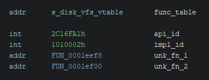
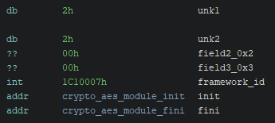

+++
title = "About the \"SBZ\" implant..."
date = 2023-04-02
description = "An overview of a historical boutique malware framework"
tags = ["malware", "reverse-engineering"]
+++

<style>
table, td, th {
    border: 1px solid;
    border-collapse: collapse;
}

td, th {
  padding: 10px;
}
</style>

## Table of Contents

1. [Introduction](#introduction)
2. [Core](#core)  
2.1. [Logging](#logging)  
2.2. [APIs](#apis)  
2.3. [Module Management](#module-management)
3. [Virtual Filesystem](#virtual-filesystem)  
3.1. [Dynamic Modules](#dynamic-modules)  
3.1.1. [ELF loader](#elf-loader)  
3.2. [Data Objects](#data-objects)
4. [Command and Control](#command-and-control)
5. [Conclusion](#conclusion)
6. [Appendix](#appendix)  
6.1 [Binary hashes](#binary-hashes)  
6.2 [Network indicators](#network-indicators)  
6.3 [YARA rules](#yara-rules)  
6.4 [Companion Git repository](#companion-git-repository)  
6.5 [Links](#links)

## Introduction

During late summer 2022, I was made aware of a sophisticated implant sample that had been uploaded to VirusTotal.

The implant [^1] is an ELF binary compiled for the Solaris operating system on the 32 bit SPARC architecture.

No development time frame is immediately evident from the binary, but ELF comments indicate that parts of it were compiled using GCC 4.5.1, 4.1.2, and 3.4.4. 

An ELF comment also indicates a target operating system version: “"@(#)SunOS 5.8 Generic February 2000.”

## Core

The main binary (“core”) contains a complex framework, which provides logging capabilities, an API registry,  
module management, and encrypted virtual file system access capabilities. 

In addition, functions that wrap certain operating system details such as memory management, threading, and synchronization primitives are also present. 

### Logging

The core as well as the modules log many steps of their own operation. 

Log message format strings are stored in obfuscated form within the binaries and are deobfuscated by a custom algorithm before the relevant message is logged:

```c
int FUN_0002a1a8(int key,char *buf,char *param_3,int length)
{
    int iVar1;
    char current;
 
    iVar1 = 0;

    if (length != 0) {
	    current = *param_3;
        while( true ) {
            current = .umul(current,key);
            buf[iVar1] = current;
            iVar1 = iVar1 + 1;
            if (iVar1 == length) break;
            current = param_3[iVar1];
        }
    }

    return key;
}

char* log_message_decrypt.fd1f1670(char *out,char *enc,int length)
{
    uint counter;
    uint xv;
    uint current;
    uint previous;
 
    if ((0 < length) && (*enc != '\0')) {
        for (counter = 1; (current = counter, (int)counter < length && (enc[counter] != '\0'));
            counter = counter + 1) {
        }
        while (previous = current, counter != 0) {
            counter = counter - 1;
            current = (uint)(byte)enc[counter];
            xv = previous ^ current;
            out[counter] = (char)xv;
            if ((xv & 0xff) == 0) {
                    out[counter] = (char)previous;
            }
        }
    }
    
    FUN_0002a1a8(0x8b,out,out,length);
    return out;
}
```

Some of the first messages logged during the core’s execution include the current architecture and operating system,
as well as the core’s version information:

```c
/* M[Host architecture: Sparc] */
log.90163d70(0x5966aefb,0x80,0,&DAT_00060350);

if (param_1[4] != 0) {
    /* M[Host OS: Solaris %d-bit, %d.%d] */
    log.90163d70(0x5966aefb,0x80,0,&DAT_00060370,param_1[4],param_1[2],param_1[3]);

    return 0;
}

/* M[Host OS: Solaris %d.%d] */
log.90163d70(0x5966aefb,0x80,0,&DAT_00060398,param_1[2],param_1[3]);
return 0;

...

/* M[Sbz %d.%d.%d.%d (Lla %d.%d)] */
log.90163d70(0x5966aefb,0x80,0,&DAT_0005fea0,2,6,1,0,4,2);
```
 
A message logged early on by the core indicates a name along with the version information: “**Sbz 2.6.1.0 (Lla 4.2)**.”

### APIs

When designing complex software with several components and interwoven dependencies, a problem arises of how dependencies between
different components can be managed.

The solution this sample's developers thought of is something I'm referring to as the API registry.

The API registry allows for the registration of function tables of a defined layout where the layout of the function table is determined by an API ID.

In some cases, multiple distinct function tables *with a shared layout* are registered with the same API ID. 

A second ID that identifies the specific implementation of an API is also used when registering the function tables,
which allows for different implementations of the same API to be registered.

An API implementation is defined by a structure set up like so:



The `api_id` field is a 32-bit integer identifying the function table layout implemented by this API implementation, 
while the `impl_id` field identifies the particular implementation. 

`func_table` points to a function table exposed by this API implementation. 

This mechanism provides an large degree of flexibility to the developers, as the underlying functions behind the API implementation's function table can be swapped out completely, but as long as the function table layout and the API ID stay the same, consumers of the API don't have to change accordingly.

Shown below is a list of different API implementations registered by the core:

| Description                     | API ID    | Implementation ID |
| ------------------------------- | --------- | ----------------- |
| Core                            | 5C16FA2 | 5030001         |
| ELF module loader               | 1C10003 | 1012002         |
| VFS access (in-memory)          | 2C16FA1 | 1080003         |
| VFS access (on-disk)            | 2C16FA1 | 1010002         |
| Cryptography (AES)              | 1C16F7F | 1010001         |
| Cryptography (XOR-based cipher) | 1C16F7F | 101F023         |
| Cryptography (No-op)            | 1C16F7F | 101F001         |
| Hashing (CRC32)                 | 1C16F80 | 1010001         |
| Hashing (MD5)                   | 1C16F80 | 1010002         |
| MD5 wrapper                     | 1C16F81 | 1010001         |
| Random number generation        | 1C16F82 | 1010001         |

Performing API-related operations is done by calling into a function table provided by a core framework that includes the API registry.

Some methods that this function table provides include methods to register/deregister API implementations, acquire/release API function tables, and get API registry version information.

## Module Management

The main organizational unit between different components of this sample is that of modules.

Modules are described by a structure with the following layout:



In all observed cases, the first four bytes have been `0x02 0x02 0x00 0x00`.

The `framework_id` field is a 32-bit integer value that has always been observed to be `1C10007`.

`init`/`fini` are module initialization and deinitialization routines, respectively.

Shown below are examples of a module's initialization and deinitialization functions:

```c
int crypto_aes_module_init(FrameworkApi *param_1,undefined4 param_2)
{
    uint uVar1;
    uint uVar2;
    int iVar3;
 
    uVar2 = crypto_aes_module_state + 1;
    while( true ) {
        uVar1 = uVar2;

        if (1 < uVar1) {
            return 0;
        }

        iVar3 = 0;
        if (uVar1 == 1) {
            iVar3 = (*(code *)param_1->register_api)
                            (param_2,&crypto_aes_api,&crypto_aes_api_registration_handle);
        }

        if (iVar3 != 0) break;

        uVar2 = uVar1 + 1;
        crypto_aes_module_state = uVar1;
    }
    return iVar3;
}

int crypto_aes_module_fini(FrameworkApi *param_1)
{
    int iVar1;
 
    iVar1 = 0;
    if (crypto_aes_module_state != 0) {
        do {
        iVar1 = 0;

        if (crypto_aes_module_state == 1) {
            iVar1 = (*(code *)param_1->deregister_api)(&crypto_aes_api_registration_handle);
        }
        } while ((iVar1 == 0) &&
                (crypto_aes_module_state = crypto_aes_module_state + -1, crypto_aes_module_state != 0));
    }
    return iVar1;
}
```

In both cases, the first parameter is a pointer to a core framework function table as described in the [API](#apis) section.

Within the initialization routines, modules typically register one or more API implementations  
corresponding to functionality provided by the given module.

The deinitialization routine is called whenever a module is unloaded, in which case API  
implementations previously registered by the module are deregistered.

Some modules are present and explicitly loaded within the core binary.

However, the real purpose of this system is to enable dynamic loading of functionality during implant runtime.

### ELF loader

To enable this, the core binary makes use of a custom ELF loader library:

```c
uVar7 = load(&local_18,local_14,sStack_2a8.st_blksize,0);
  if (uVar7 != 0) {
    /* M[doLoaderLoad: load() failed, %08x] */
	sbz_log.90163d70(0x4c2d642d,0xa0,0,&DAT_0005eec8,uVar7);
	system_memzero_and_free.44611a64(local_14);
	puVar2->loader_return = 2;
	puVar2->error = uVar7;
	puVar2->loader_state = 0x12;
	return 2;
  }
  uVar7 = link(local_18,DAT_00077914,&PTR_PTR_FUN_00074334);
  if (uVar7 == 0) {
	uVar7 = map(local_18,&PTR_PTR_FUN_0007433c);
	    if (uVar7 == 0) {
  	        uVar7 = lookup(local_18,&local_1c,"ofn",0,0);
  	            if (uVar7 == 0) {
    	                uVar8 = *(undefined4 *)(local_1c + 0x14);
                	    /* M[dLL: ep 0x%08x/%p] */
    	                sbz_log.90163d70(0x4c2d642d,0x80,0,&DAT_0005ef70,param_1,uVar8);
  	            }
```

Instead of using built-in OS mechanisms for loading an ELF binary, the loader is entirely custom.

This technique is reminiscent of similar techniques on Windows, e.g. "manual mapping" or "reflective loading."

After mapping an ELF in memory, the module loader code looks up a named symbol exported from the mapped ELF named `ofn`.

`ofn` functions are expected to return a pointer to a static module struct as described above.

Interestingly, some checks are present within the ELF loader library code for Mach-O magic numbers:

```c
if (((uVar1 != 0xcefaedfe) && (uVar1 != 0xfeedface)) &&
 	((uVar1 != 0xcffaedfe &&
  	(((uVar1 != 0xfeedfacf && (uVar1 != 0xbebafeca)) && (uVar1 != 0xcafebabe)))))) {
	return 0xd000000c;
}
```

This implies that a version of the loader may have existed for Apple platforms.

## Virtual Filesystem

One API implementation present in the core allows for consumers to access an on-disk virtual filesystem. 

Each virtual file (“object”) is represented on disk by an encrypted container file, 
and objects are typically referenced in code by three 32-bit identifiers. 

Several configuration items are present that can be used to control behaviors exhibited by the virtual filesystem:

| Configuration item | Default value                   | Description                                                                                        |
| ------------------ | ------------------------------- | -------------------------------------------------------------------------------------------------- |
| objDir             | “.”                             | Directory used to store container files.                                                           |
| maxSize            | 0x6400000                       | Max combined size of virtual file objects.                                                         |
| maxUsePct          | 75                              | Max usage percent of virtual filesystem.                                                           |
| fileTmpl           | “%k1[]x-%k2[]x-%k3[]x.bak%v[]d” | Template used to generate the on-disk filename of encrypted container files.                       |
| xorValue           | 0                               | Used as a seed when generating file names from fileTmpl.                                           |
| cleanOnFini        | FALSE                           | Unlink container files from disk when shutting down the core.                                      |
| isD                | FALSE                           | Don’t allow writes to container files, unlink any currently open container files when closed.      |
| encPvid            | 0xF023                          | Lower part of ID for the cryptography API implementation used to encrypt virtual file object data. |

The listed default values are hardcoded into the core binary.

When the core starts for the first time on an infected system, it decompresses several serialized blobs from a compressed storage container appended to the end of the core binary. 

Following decompression, the core deserializes these blobs and writes the contained items to the virtual filesystem:

```c
status = framework_deserialize_u32.254c2227(deserializer,&count);
if ((count != 0) && (status == 0)) {
    while( true ) {
        object_len = 0;
        object = (void *)0x0;

        status = framework_deserialize.e3aee120
                    (deserializer,&serialized_module_map,&id_1,&id_2,&id_3,&object,&object_len);

        if (status != 0) break;

        object_handle = (*(code *)vfs_func_table->open)(id_1,id_2,id_3);
        if (object_handle == 0) {
            system_memzero_and_free.44611a64(object);
            return 0xf0000002;
        }

        status = (*(code *)vfs_func_table->write)(object_handle,object,object_len);
        (*(code *)vfs_func_table->close)(object_handle);

        system_memzero_and_free.44611a64(object);
        count = count + -1;
        
        if (count == 0) {
            return status;
        }

        if (status != 0) {
            return status;
        }
    }
}
return status;
```

Items initially written to the virtual filesystem include dynamic ELF modules and configuration data.

### Dynamic Modules

Among items initially written to the virtual filesystem, 34 of them are additional ELF modules.

Given the sheer number of modules and complexity of certain modules, not all functionality has been completely reversed. 

As such, this table provides a brief and non-exhaustive summary of each module’s functionality:


| Module ID | Description                                                                                                                                                                                                                                                                                                                                                                                                                                                                                                                                                                                                                                                                      |
| --------- | -------------------------------------------------------------------------------------------------------------------------------------------------------------------------------------------------------------------------------------------------------------------------------------------------------------------------------------------------------------------------------------------------------------------------------------------------------------------------------------------------------------------------------------------------------------------------------------------------------------------------------------------------------------------------------- |
| 21AB      | Provides code execution capabilities, including:<br><br>- Load ELF in memory using its own statically linked copy of the [custom ELF loader](#elf-loader) library and invoke a symbol by name<br>- Execute an arbitrary shell command using `/bin/sh   `                                                                                                                                                                                                                                                                                                                                                                                                                                          |
| 2345      | File exfiltration tasking system.<br><br>Tasks can be added with a watch directory, a regular expression matching on filenames of interest, and various other configurable parameters. Periodically, tasks are iterated over to find new files of interest.<br><br>Uses a statically linked copy of the Apache Portable Runtime open source library for filesystem and IO operations.                                                                                                                                                                                                                                                                                            |
| 234A      | System survey capabilities, including:<br><br>- Gather hostname<br>- Operating system version, release name, bitness<br>- uname string<br>- Current uptime<br>- RAM and swap information<br>- CPU clock speed, core count, type, FPU type, state<br>- Load average over last minute, 5 minutes, 15 minutes<br>- Host ID<br>- UTC, offset time<br>- Process listing with usage, status, UID<br>- List of all mounted partitions, their sizes, free space, volume serial numbers<br>- Environment variables<br>- Installed packages, name, version, install date                                                                                             |
| 24EE      | Provides network survey functionality:<br><br>- Get network interface information<br>- Interface throughput (bits per second)<br>- Link status<br>- Received bytes/queued to be sent bytes<br>- Received packets/queued to be sent packets<br>- Packets sent/received that contained errors<br>- Number of times overflow occurred during receive<br>- Ethernet collision count<br>- Carrier lost count<br>- IPv4/IPv6 address<br>- Information about all active TCP/IP sockets, UNIX domain sockets<br>- ARP cache<br>- Unused functionality for responding to ARP requests<br><br>Statically linked to the libnet and libpcap open source libraries. |
| 2776      | Timer object utility.                                                                                                                                                                                                                                                                                                                                                                                                                                                                                                                                                                                                                                                            |
| 2777      | Serializes and queues up special status messages to be exfiltrated.<br><br>The messages include the follow information:<br><br>- Core version<br>- Core compiled architecture/OS<br>- Core string identifier<br>- UUID specific to this sample<br>- Local interface IP addresses<br>- Other internal networking/session/channel state data<br><br>During module init, a timer object is created such that the messages are generated and queued up to be exfiltrated on a configured interval.                                                                                                                                                                       |
| 277D      | Utilities wrapping module 277E.                                                                                                                                                                                                                                                                                                                                                                                                                                                                                                                                                                                                                                                  |
| 277E      | Provides utilities to dynamically call into API implementations with a context struct identifying the caller and a user-provided serialized argument buffer.                                                                                                                                                                                                                                                                                                                                                                                                                                                                                                                     |
| 277F      | Thread utilities.                                                                                                                                                                                                                                                                                                                                                                                                                                                                                                                                                                                                                                                                |
| 2780      | Parses communications channel configuration data, calls API implementations from module 2792.                                                                                                                                                                                                                                                                                                                                                                                                                                                                                                                                                                                    |
| 2782      | Utilities wrapping module 277E.                                                                                                                                                                                                                                                                                                                                                                                                                                                                                                                                                                                                                                                  |
| 2786      | “inbox” communications channel. Only provides implementation for receiving messages.                                                                                                                                                                                                                                                                                                                                                                                                                                                                                                                                                                                             |
| 2787      | “outbox” communications channel. Only provides implementation for sending messages.                                                                                                                                                                                                                                                                                                                                                                                                                                                                                                                                                                                              |
| 278A      | Provides a large amount of internal networking utilities.                                                                                                                                                                                                                                                                                                                                                                                                                                                                                                                                                                                                                        |
| 278F      | HTTP client communications channel, both sending and receiving messages is supported.                                                                                                                                                                                                                                                                                                                                                                                                                                                                                                                                                                                            |
| 2790      | HTTP server communications channel, both sending and receiving messages is supported.                                                                                                                                                                                                                                                                                                                                                                                                                                                                                                                                                                                            |
| 2792      | Provides utilities for acquiring communications channel API implementations and interacting with them.                                                                                                                                                                                                                                                                                                                                                                                                                                                                                                                                                                           |
| 2795      | Registers API implementation used by communications channels.                                                                                                                                                                                                                                                                                                                                                                                                                                                                                                                                                                                                                    |
| 2797      | Ring buffer utility                                                                                                                                                                                                                                                                                                                                                                                                                                                                                                                                                                                                                                                              |
| 2799      | Cryptography API implementation (unknown cipher)                                                                                                                                                                                                                                                                                                                                                                                                                                                                                                                                                                                                                                 |
| 279A      | Provides remote core management functionality.                                                                                                                                                                                                                                                                                                                                                                                                                                                                                                                                                                                                                                   |
| 279B      | Provides remote virtual file system management functionality.                                                                                                                                                                                                                                                                                                                                                                                                                                                                                                                                                                                                                    |
| 279C      | Manages communication channel connections.                                                                                                                                                                                                                                                                                                                                                                                                                                                                                                                                                                                                                                       |
| 279D      | Provides additional remote core management functionality, including:<br><br>- Restart core<br>- Shutdown core<br>- Get core version, identifier<br>- Get core compiled OS/architecture<br>- Upgrade core                                                                                                                                                                                                                                                                                                                                                                                                                                                                   |
| 279E      | Registers custom callback for internal logging system. Continuously queues up global log buffer to be exfiltrated.                                                                                                                                                                                                                                                                                                                                                                                                                                                                                                                                                               |
| 279F      | Provides remote ELF module management functionality (add new module, upgrade existing module, etc.)                                                                                                                                                                                                                                                                                                                                                                                                                                                                                                                                                                              |
| 27A0      | Provides utilities for queueing up data to be exfiltrated.                                                                                                                                                                                                                                                                                                                                                                                                                                                                                                                                                                                                                       |
| 27A5      | Provides API implementation for getting/setting/generating a new 16 byte value that uniquely identifies a sample.                                                                                                                                                                                                                                                                                                                                                                                                                                                                                                                                                                |
| 27A6      | API implementation wrapper for zlib open source library.                                                                                                                                                                                                                                                                                                                                                                                                                                                                                                                                                                                                                         |
| 27D9      | Provides functionality for listening on a socket for an inbound connection or establishing an outbound connection on the local network. All packets are forwarded over an established communications channel.                                                                                                                                                                                                                                                                                                                                                                                                                                                                    |
| 27DA      | Utilities wrapping module 277E.                                                                                                                                                                                                                                                                                                                                                                                                                                                                                                                                                                                                                                                  |
| 27DB      | Utilities wrapping module 277E.                                                                                                                                                                                                                                                                                                                                                                                                                                                                                                                                                                                                                                                  |
| 27FA      | API implementation wrapper for Perl-Compatible Regular Expression open source library.                                                                                                                                                                                                                                                                                                                                                                                                                                                                                                                                                                                           |
| 2811      | File system utilities.<br><br>Provides, among other unknown functionality:<br><br>- Get file hash<br>- Write file contents<br>- Read file contents<br>- Rename/move files<br>- Change file permission bits<br>- Get directory/file listing<br><br>Uses a statically linked copy of the Apache Portable Runtime open source library for filesystem and IO operations.                                                                                                                                                                                                                                                                                                 |

### Data Objects

Here is a list of all configuration data initially written to the virtual file system:

| Data ID                    | Description                                                            |
| -------------------------- | ---------------------------------------------------------------------- |
| 01816F8F_00000001_00000000 | Communications link provider configuration data parsed by module 2780. |
| 01816F92_00000001_00000000 | Configuration data.                                                    |
| 01816F92_FF000001_00000000 | Configuration data read by module 2780.                                |
| 01816FA2_00030001_00000002 | Batch of module identifiers identifying modules to load.               |
| 01816FA2_00030001_00000003 | Batch of module identifiers identifying modules to load.               |
| 01816FA2_00030001_00000004 | Empty list of module identifiers.                                      |
| 01816FA2_00030001_00000005 | Batch of module identifiers identifying modules to load.               |
| 01816FB5_01010001_00000001 | Configuration data for module 279E.                                    |
| 0181703D_00010001_00000001 | Configuration data for module 2777.                                    |
| 01C16F96_03010001_00000003 | Configuration data for module 279D.                                    |
| 01C16F9D_01010001_00000001 | 16 byte UUID - read by module 27A5.                                    |
| 01C16FA2_B0071234_00000001 | Core configuration data.                                               |
| 02C16F98_FEEDBEEF_00000000 | Configuration data for module 27A0.                                    |

## Command and Control

This sample incorporates a very complex and flexible command and control system. 

Modules that provide mechanisms to send exfiltrated data or receive commands can register implementations of the “channel API” (1C16F8D),  
providing a unified interface to communicate with other implants or a listening post.

Contained in virtual file object `01816F8F_00000001_00000000` is a listing of various communications channels that the implant is configured to use:

| “Hostname”     | Port  | Cryptography API implementation | Channel API implementation | Module | Send/receive |
| -------------- | ----- | ------------------------------- | -------------------------- | ------ | ------------ |
| ./outbox       | N/A   | 101F001                         | 101001B                    | 2787   | Send         |
| ./inbox        | N/A   | 101F001                         | 101001C                    | 2786   | Receive      |
| 182.162.80.21  | 49282 | 101F023                         | 101F559                    | 278F   | Send         |
| 219.111.208.59 | 42892 | 101F023                         | 101F559                    | 278F   | Send         |
| 182.162.80.21  | 49282 | 101F023                         | 101F55B                    | 278F   | Receive      |
| 219.111.208.59 | 42892 | 101F023                         | 101F55B                    | 278F   | Receive      |
| 0.0.0.0        | 33465 | 101F023                         | 101F55A                    | 2790   | Send         |
| 0.0.0.0        | 33465 | 101F023                         | 101F55C                    | 2790   | Receive      |

This table can be interpreted like so:

- Save exfil data to files within a directory called “outbox” in the current working directory of the implant.
- Read commands from files within a directory called “inbox” in the current working directory of the implant.
- Establish a connection over HTTP with 182.162.80.21:49282.
- Establish a connection over HTTP with 219.111.208.59:42892.
- Listen for an incoming HTTP connection on port 33465.

The inbox/outbox channels use the cryptography API with implementation ID `101F001`, which is a "no-op" cipher.

As such, data is simply copied without being encrypted/decrypted. 

All configured HTTP channels use `101F023`, which is a XOR-based cipher which I have been unable to identify.

The "Module" column of the table identifies which dynamic module registers the channel API implementation in use by a given channel.  

Of particular interest are the "inbox" and "outbox" communications channels.

For either of those channels to be active, the corresponding directory must exist in the working directory of the implant, 
and the directories are not created by default. 

It's my belief that those directories could be created in special cases where external tools are used to tunnel communications to/from the implant.

## Conclusion

Studying the tools used by the best of the best in the APT world is a highly enriching experience.

It left me with an appreciation for the effort that went into writing these components, and left me wondering what today's "apex threat actors"'s implants might look like.

## Appendix

### Binary hashes

2FE44C9336D4CD84E9936A0EC68FAEF1                                   	 
95C1813B46DFE97AFC36556B421AC662                  	 
3120BA7C20DE0740B9F3343D7341D624                  	 
A09C662AF64B554BDA5415B8EEAD96E4                  	 
D163F3C124FA736555A8548CEF3FCDB2                  	 
C0877B1ADBE401BA0E8F8073B1FB8572                  	 
390AE9BB00299116DA7D94EC6FB43D34                  	 
6DE9174B77E885EF21113A5B6EEB48A7                  	 
2E72DCFB71C060BA377A2C9327E07520                  	 
999C092E1194FA8C10CDDDAF331DEB85                  	 
77242A9F99D815B0CA876A2204AF59E7                  	 
3C5D4AFEE719B023A2477DF878521176                  	 
3BC3B0B750E1F0F8FE9D085D7CC71D5B                  	 
906C916AF1B24A05E9700D39C8DA128B                  	 
A85EAAA17766E7FFB000727AFD10FF6C                  	 
1F20C3543C782547FAC31B66B04267DC                  	 
52E5AA0EA655C0882FFB022156A6411F                  	 
F83EF6EFE1556C980DC9A009400CA223                  	 
77DB36C28DF50E31A413CD6D3864F7AE                  	 
1D6E98AA4DB3B81319796E690EB512EB                  	 
851F8F2A6BBCB77CFF04F5B4CAA5F91E                  	 
40E5A4B3B4C8B5FC3A6DF11D15E58AC5                  	 
0C155FE137058F685F64F2FBE781B80D                  	 
D3CFF4B643CD8FA1B689C475FC6CF8C3                  	 
F73CB4DB1B1640A7D7C4A060DC7FC96A                  	 
D41C2C0AC1276CE3E434AB36A8A09E01                  	 
48EDF51BAAEA9DE325F70049779F4DEC                  	 
06C08F746CB4637620DD381AB5B2215B                  	 
C63E9E04917F66C268BEFAE9FE634637                  	 
58FDEEA723CF2DFB5A3CD7BF2B003444                  	 
95F845156CB82A5446695DFA30325302                  	 
A9A71D1CE681D5B6EB6327AB8D6C71B8                  	 
C9C058E9E1F68DFB1DC77B9EABF1F76A                  	 
96B58457A33DD6C62785B9498B22BFF8                  	 
F4DF56203A37706C9E224F29B960DC21

### Network indicators

182.162.80.21  
219.111.208.59

### YARA rules

```yara
import "elf"

rule Hunting_SBZ_Obfuscation {
    meta:
   	    author = "netadr"
   	    info = "This rule is UNTESTED against a large dataset and is for hunting purposes only."

    strings:
   	    // xor g3, 0x47, o5
   	    // xor o5, g1, o5
   	    // xor g2, o5, o5
   	    $xor_block = { 9A 18 E0 47 9A 1B 40 01 9A 18 80 0D }

    condition:
   	    elf.type and
   	    elf.machine == elf.EM_SPARC and
   	    $xor_block
}

rule Hunting_SBZ_UniqueStrings {
    meta:
   	    author = "netadr"
   	    info = "This rule is UNTESTED against a large dataset and is for hunting purposes only."

    strings:
   	    $s1 = "<%u>[%s] Event #%u: "
        $s2 = "ofn"

        // suggested by https://twitter.com/adulau/status/1553401532514766848
        $s3 = "diuXxobB" 
        $s4 = "CHM_FW"

    condition:
   	    2 of ($*)
}

rule Hunting_SBZ_ModuleStruct {
	meta:
        author = "netadr"
  	    info = "This rule is UNTESTED against a large dataset and is for hunting purposes only."
    
	strings:
  	    $be = { 02 02 00 00 01 C1 00 07 }
   	    $le = { 02 02 00 00 07 00 C1 01 }

	condition:
        $be or $le
}
```

### Companion Git repository

For various tools and other bits I created while working on this research, go here. [^2]

The password for the samples archive is `D2vMR9wK5PxdAyrjh2kzCbzL`.

### Links

[^1]: <https://www.virustotal.com/gui/file/5cdfbfaad93f79d42feecf08a9c7afa5363c847d3e9cb18c3d6188a757b292c6>

[^2]: <https://github.com/netadr/sbz>
