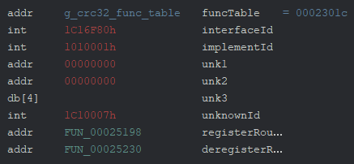

+++
title = "What is \"SBZ\"?"
date = 2022-12-01
description = "A brief overview of an old novel malware framework"
tags = ["malware", "reverse-engineering"]
+++

## Introduction

Some months ago, a tweet [^1] was brought to my attention by a collegue.

This tweet includes a hash for an ELF binary [^2]
compiled for Solaris on the SPARC architecture. 

| Name | MD5 | Size | Extra info |
| ---- | --- | ---- | ---------- | 
| 5 | f4df56203a37706c9e224f29b960dc21 | 1091417 | Submitted to VirusTotal on June 6th, 2018. |

*This is far from a complete analysis of the binary. This post serves as a general overview, and to hopefully encourage further research.*

## Analysis

While triaging the binary, its size of over 1MB stuck out.

Looking at Ghidra's memory map, there is an unallocated section present in the binary:


The unallocated section is 731KB in size, which is a majority of the binary's size.

In addition, the binary has a Shannon entropy value of 7.703, indicating the presence of
encrypted or compressed data.

The binary also has several named symbols, albeit several appear to have names
derived from hashing the original function names.

### API Providers

```c
undefined4 acquire_crc32_api(int param_1,undefined4 param_2)
{
  undefined4 uVar1;
  
                    /* Crc32ref interface */
  uVar1 = (**(code **)(param_1 + 0x1c))(param_2,0x1c16f80,2,0,&DAT_00077890,&DAT_00077894);
  return uVar1;
}
```

Constructs such as these are common in the binary's code. 

The second parameter of the indirect function call represents an interface or API identifier.

In the `.rodata` segment of the binary, there are structures that appear to be descriptors for the various available APIs:



The `interfaceId` field indicates the unique identifier of the API and the `implementId` field appears to identify the implementor.

`funcTable` fields point to function tables usable by API consumers.  

In cases where the `interfaceId` is the same but the `implementId` is different between two API descriptors, the layout of the function
tables pointed to by `funcTable` matches.  

This approximates the functionality of a virtual table, although the binary itself appears to have been written in C.

`unk1` and `unk2` have been empty in all cases I've observed, `unk3` is always `20 20 00 00`, and `unknownId` is always `0x1c10007`.

`registerRoutine` and `deregisterRoutine` appear to point to functions that register and deregister the API, respectively.

### Logging

Advanced attackers that are maintaing long-term operations at scale 
may find themselves desiring a way to get diagnostics from implants in the field. 

This sample does not disappoint, extensively logging many steps of its own operation. 

Log invocations look like so:

```c
/* M[Sbz %d.%d.%d.%d (Lla %d.%d)] */
log(0x5966aefb,0x80,0,&DAT_0005fea0,2,6,1,0,4,2);
```

The first parameter is likely a module identifier, and the second parameter is a log level.

The third parameter is always zero, while the fourth parameter is a obfuscated format string that is decoded 
by a custom XOR-based algorithm. The rest are variadic arguments that are formatted according to the decoded format string. 

One of the first things logged by the implant during its execution is its version: `Sbz 2.6.1.0 (Lla 4.2)`.

A list of all decrypted log format strings and other obfuscated strings from the main binary can be found here [^3].

### Loader

A dynamic module loading system is present within the implant. 

The loader uses a technique resembling manual mapping on Windows, where binaries are 
mapped, fixed up, and executed entirely in-memory without touching disk. 

The loader has the capability to load binaries from a custom virtual filesystem - referred to in log messages as `DiskStore`:

```c
if (_DAT_00077918 == 0) {
                  /* Store interface */
  iVar3 = (**(code **)(_DAT_00077910 + 0x1c))
                    (_DAT_00077fbc,0x1c16fa1,2,0,&DAT_00077918,&g_vfs_func_table_ptr);
  if (iVar3 != 0) {
    g_vfs_func_table_ptr = (vfsFuncTable *)0x0;
    _DAT_00077918 = 0;
LAB_00033898:
                  /* M[doLoaderLoad: can't acquire disk store api] */
    log(0x4c2d642d,0xc0,0,&DAT_0005ee98);
    puVar2[5] = 0x17;
    *(undefined *)((int)puVar2 + 0x12) = 0xc;
    return 0x17;
  }
  if (_DAT_00077918 == 0) goto LAB_00033898;
}
iVar3 = (*(code *)g_vfs_func_table_ptr->open_handle)(0x1c10003,0x1012002,uVar7);
sStack680.st_blksize = (*(code *)g_vfs_func_table_ptr->get_size)(iVar3);
if (sStack680.st_blksize == 0) {
                  /* M[doLoaderLoad: DiskStore object %x %x %x does not exist] */
  log(0x4c2d642d,0xa0,0,&DAT_0005ee58,0x1c10003,0x1012002,uVar7);
  (*(code *)g_vfs_func_table_ptr->close_handle)(iVar3);
  puVar2[5] = 0x10;
  *(undefined *)((int)puVar2 + 0x12) = 10;
  return 0x10;
}
```

The capability to lookup symbol names in modules and link them to corresponding symbols in the 
main binary is present.  

An interesting detail about the loader is that in addition to checking for the standard `\x7fELF` 
header, it also checks for headers associated with Mach-O binaries:

```c
if (((uVar1 != 0xcefaedfe) && (uVar1 != 0xfeedface)) &&
  ((uVar1 != 0xcffaedfe &&
    (((uVar1 != 0xfeedfacf && (uVar1 != 0xbebafeca)) && (uVar1 != 0xcafebabe)))))) {
  return 0xd000000c;
}
```

This could imply that a version of this implant existed for Darwin-based operating systems. 

While investigating the module system, I had the idea to debug the running implant on a Solaris instance 
and attempt to dump any modules from memory as they were loaded. 

I ended up writing a GDB script [^4] to break immediately after the module had been read into memory from the virtual file system.  

Executing this script while debugging the implant lead to the recovery of **no less than 31 modules** present
within the implant.

These modules likely reside in encrypted form within the unallocated section [mentioned above,](#analysis) made 
accessible via the `DiskStore` API.

### Modules

Each module is an ELF shared object file with at least one named export `ofn`.

Modules also import named symbols for the main binary - certain external symbols share the same hashed
names in the modules as the functions in the implant.  

Analyzing the modules has been difficult because cross references within them don't resolve properly in Ghidra,
and the issue responsible has continued to elude me.

If anyone has experience with analyzing ELF binaries compiled for the SPARC architecture, don't hesitate to reach out!

From what I'm able to gleam, here's a description of all modules:

| Module ID | Notes                                            |
|-----------|--------------------------------------------------|
| 0x2345    | Statically linked with Apache Portable Runtime   |
| 0x24ee    | Statically linked with libpcap (version 1.3.0)   |
| 0x2776    | *Unknown*                                        |
| 0x2777    | Network adapter enumeration                      |
| 0x277d    | *Unknown*                                        |
| 0x277e    | Contains string in cleartext: "RPCMGR"           |
| 0x277f    | *Unknown*                                        |
| 0x2780    | *Unknown*                                        |
| 0x2782    | *Unknown*                                        |
| 0x2786    | File manipulation functionality                  |
| 0x2787    | Directory enumeration/manipulation functionality |
| 0x278a    | *Unknown*                                        |
| 0x278f    | Network functionality (sockets)                  |
| 0x2790    | Network functionality (sockets)                  |
| 0x2792    | *Unknown*                                        |
| 0x2795    | *Unknown*                                        |
| 0x2797    | *Unknown*                                        |
| 0x2799    | *Unknown*                                        |
| 0x279a    | *Unknown*                                        |
| 0x279b    | *Unknown*                                        |
| 0x279c    | Time utilities (get time in GMT/UTC, local TZ)   |
| 0x279d    | *Unknown*                                        |
| 0x279e    | Additional time utilities                        |
| 0x279f    | *Unknown*                                        |
| 0x27a0    | *Unknown*                                        |
| 0x27a5    | *Unknown*                                        |
| 0x27a6    | Inflate library (version 1.2.7)                  |
| 0x27d9    | Contains string in cleartext: "PackTun"          |
| 0x27da    | *Unknown*                                        |
| 0x27db    | *Unknown*                                        |
| 0x27fa    | PCRE library                                     |

## Conclusion

I hope this post has inspired others to look at this fascinating malware sample.  

Things to be investigated further include:
- Functionality of modules
- Mechanism of communication between modules
- Obfuscated log format strings present in modules
- Structure of virtual file system
- Presence of configuration data for implant/modules
- C&C communications
- ...

The main implant as well as the extracted modules can be found [here.](files.zip) (password: infected)

## Footnotes

[^1]: <https://twitter.com/deresz666/status/1485626389407703044>

[^2]: <https://www.virustotal.com/gui/file/5cdfbfaad93f79d42feecf08a9c7afa5363c847d3e9cb18c3d6188a757b292c6>

[^3]: [sbz_main_strings.txt](sbz_main_strings.txt)

[^4]: [sbz_gdb_script.txt](sbz_gdb_script.txt)