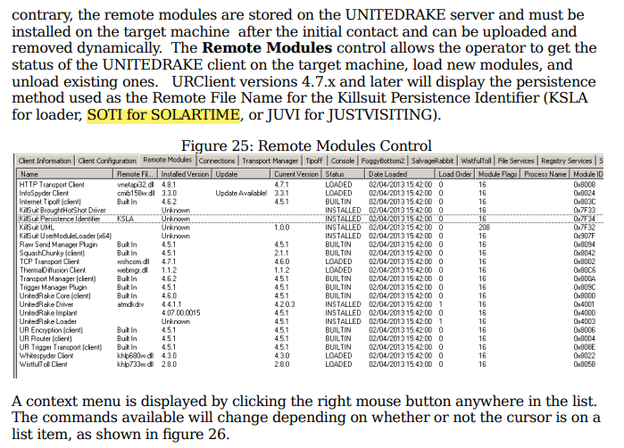
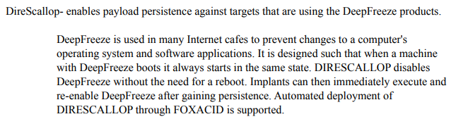
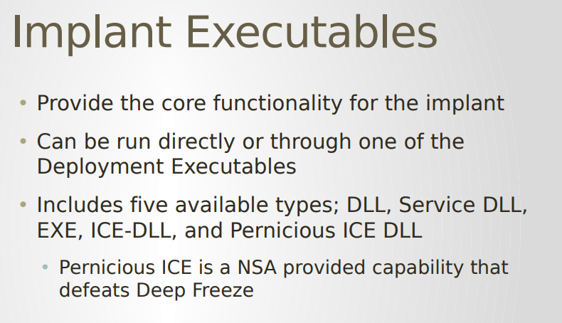
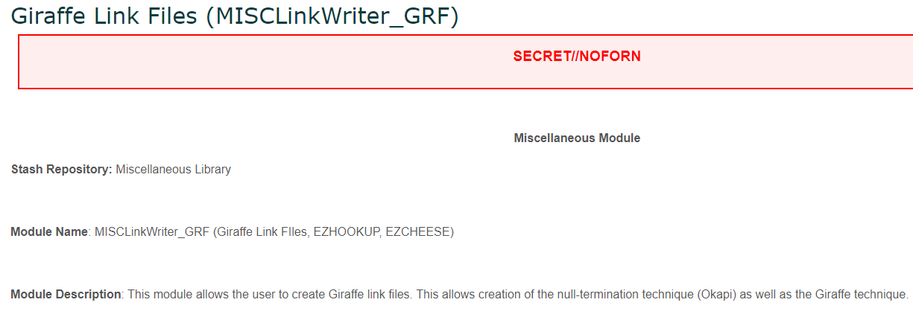
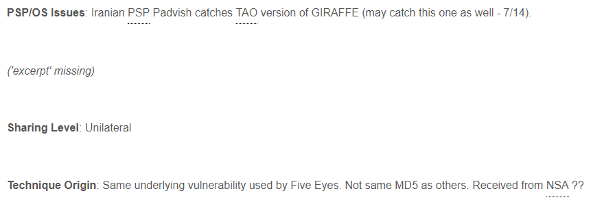
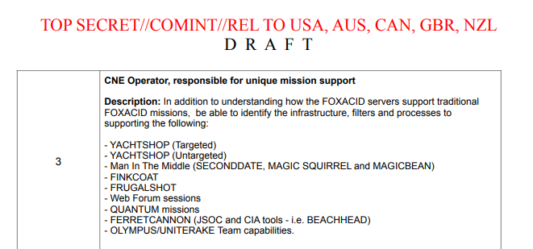
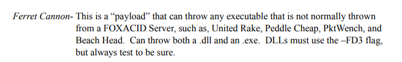

+++
title = "On Equation Group Attribution"
date = 2022-08-15
description = "Adding context to the relationship between Equation Group and other threat actors"
tags = ["malware", "threat-intelligence"]
aliases = ["on-equation-group-attribution"]
+++

*This article and the mentioned article both cite leaked classified documents, if you have an active security clearance beware.*

## Foreword

Recently, I came across an interesting article [^1] on Twitter regarding Equation Group attribution.

This article provides a very good overview of why Equation Group can't be simply reduced to NSA's Tailored Access Operations. 

Like many others have pointed out and as this article mentions, WikiLeaks's Vault7 dump includes a Confluence page titled *What did Equation do wrong, and how can we avoid doing the same?*. [^2]

The page includes a discussion by members of CIA's Center for Cyber Intelligence about how they can avoid making the mistakes Equation Group did 
that lead to Kaspersky being able to tie a significant amount of Equation's Windows toolkit together.

One highlight of this discussion is a comment that indicates that Equation Group refers not to a single group but to a collection 
of tools used *both* by NSA's TAO and CIA's CCI (known to the threat intelligence community as the Lamberts).

In this drabble, I'd like to present some random observations I've had that have led me to a similar conclusion. Some of these observations I've 
seen mentioned in the public domain, and some I've never seen mentioned before.

## Angelfire

After the main Vault7 release, WikiLeaks began publishing smaller batches of documents that described specific CCI tools and capabilities. 

One such batch includes a user's guide for a tool with the cover term Angelfire. [^3]

Angelfire is made up of five different components:
 - Solartime -
    Patches the boot sector in order to hijack the boot process and force Windows to load a driver from 
    a encrypted and compressed container file during startup.
 - Wolfcreek - 
    The kernel driver that Solartime passes execution to. Can load additional kernel and user mode 
    payloads from the BadMFS covert file system.
 - Keystone - 
    Code used by Wolfcreek for starting user mode payloads.
 - BadMFS - 
    An encrypted covert file system that resides in empty space at the end of the active disk partition.
    Stores additional kernel drivers, DLLs, and executables started by Wolfcreek and Keystone.
 - Windows Transitory File - 
    A system used to interact with the Angelfire components. Allows an operator to uninstall the Angelfire
    framework, add additional payloads to BadMFS, etc.

Solartime might sound familiar to anyone who has researched the Shadow Brokers leaks: [^4]



Solartime/SOTI is actually present in the "Lost in Translation" dump that included the now-infamous 
Eternal series of SMB exploits. Looking at the relevant Python scripts in the dump, we can see that it's listed [^5] as a supported persistence method for the KillSuit framework.
Further research about KillSuit can be in the footnotes. [^6] [^7]

Interestingly enough, KillSuit and Angelfire have a very similar concept of operations. Both frameworks provide stealthy persistence to other tools, 
allow for injecting DLLs and covertly loading unsigned drivers, and store those additional payloads in an encrypted virtual file system.

At the very least, this shows that both TAO and CCI used Solartime to provide persistence capabilites to similar frameworks. 
As for the similarity between the two frameworks, I will refrain from drawing further conclusions.

## Defeating Deep Freeze

Faronics Deep Freeze [^8] is a thorn in the side for any threat actor attempting to persist their tools on targeted machines.

Indeed, NSA's TAO appears to have developed a solution for that problem: [^9]



The DireScallop tool is also mentioned in DriverList.db, a SQLite database included in the "Lost In Translation" dump 
that includes names and hashes of drivers along with corresponding descriptions. This file was used to give operators
situational awareness regarding the drivers running on systems that had been implanted.

Here's an excerpt of the DriverList.db file after being converted to CSV: [^10]

```
sysfrz.sys,*** PERNICIOUSICE 1.0.0.2 ***,TOOL_HASH,65e9f85dd3794e75169c439ae1ed02220dd65a90,,
sysfrz.sys,*** PERNICIOUSICE 1.0.1.3 ***,TOOL_HASH,cd41cb4d1c0e8774c7bedb03d6a9430796b9f624,,
sysfrz.sys,*** PERNICIOUSICE 1.0.1.5 ***,TOOL_HASH,3f7d1daf600de63f212a4588f2583ad46281d5e3,,
sysfrz.sys,*** PERNICIOUSICE 1.0.2.2 ***,TOOL_HASH,aaec63a0751765e63a4a1f63db6b18a3ebbf10cb,,
sysfrz.sys,*** DIRESCALLOP 2.3.0.1 ***,TOOL_HASH,d822280852f10903bcdc12ffb8212df4636a4e14,,
alsa.sys,*** DIRESCALLOP 2.0.0.2 ***,TOOL_HASH,34e19f5e0f5496196676ff2955d61e520ee7a989,,
```

[^11]

Next to DireScallop, another tool called PerniciousIce is mentioned. This is notable because a Vault7 release describing a CCI tool 
called Assassin also mentions [^12] PerniciousIce:



This slide indicates that PerniciousIce was initially developed by NSA, but was shared with CIA's CCI.

## EZHOOKUP or EASYHOOKUP?

While doing research into the Shadow Brokers "Lost in Translation" leak, I looked extensively into the post-exploitation capabilities that would be deployed 
after a box had been exploited in order to interact with the box. 

Of particular interest were the many scripts that operators could run to automate certain actions on compromised boxes. 

Many scripts were of an informational nature, and would help provide operators with situational awareness regarding the box they were on. 

One such script [^13] for the ExpandingPulley implant checks to see if a hotfix for the "EASYHOOKUP" exploit has been applied:

```
#####################################################
#      Check for ESH patch
#####################################################
@echo off;
if (`regquery -hive L -subkey "software\\microsoft\\windows nt\\currentversion\\hotfix\\KB2286198"` || `regquery -hive L -subkey "software\\microsoft\\windows\\currentversion\\uninstall\\KB2286198"`) {
	echo "";
	echo "********************************************************************";
	echo "* ALERT: EASYHOOKUP PATCH FOUND!                                   *";
	echo "********************************************************************";
	echo "";
} else {
	echo "GOOD: No ESH patch found.";
}
@echo on;
```

Looking online I very quickly realized that these hotfixes patched a security issue known as MS10-046. 

This issue was the same issue exploited by Stuxnet, involving a crafted LNK file that would enable execution
whenever a compromised removable media device was plugged in to a Windows system. 

Despite the fact that a hotfix was issued for this issue, it was never properly patched until 2015. [^14]

Looking through Vault7 at a later date, I saw this Confluence page: [^15]





The former Confluence page links the Giraffe technique with the EASYHOOKUP exploit, while the latter 
states that the technique has been shared by NSA TAO with CCI and across the Five Eyes intelligence alliance.

## dll_u my beloved

I'm going to take a detour here and introduce a third organization in addition to the NSA's TAO and CIA's CCI. 

During Kaspersky's SAS2018 conference, they unveiled research [^16] on a threat actor they tracked as "Slingshot." 

Slingshot is a fascinating threat actor whose toolkit included a complex kernel mode driver and a modular implant with infostealer capabilites. 

Shortly after Kaspersky lifted the curtain on Slingshot, CyberScoop reported [^17] that Slingshot 
was an effort by Joint Special Operations Command in the US to collect intelligence on al-Qaeda and ISIS members in developing countries.

One detail that has been pointed out [^18] by other professionals in the industry is that a Slingshot tool [^19] 
exports a symbol by the name `dll_u`, which is a name several Equation Group tools have used. [^20] [^21] [^22] [^23]

*Please note the rest of this section is almost entirely based on speculation. Despite this fact, I still wanted to include this part because I've never seen the potential connections made elsewhere publicly.*

Looking back at one [^9] of the Snowden documents describing a server software used by TAO to throw web browser exploits, there could be a reason for this:




It's entirely possible, as the Slingshot tool that shares the `dll_u` export is a simple downloader, that that tool was engineered in a way such that 
it could be thrown from TAO's browser exploitation servers.

Given that JSOC/Slingshot's campaign appeared to be highly localized and smaller in scope, it's likely their initial access capability wasn't as developed
as TAO's.

If true, this would have necessitated them to piggyback off of TAO's initial access capability (FOXACID) in order to get a foothold into certain networks.

## Vulnerable Drivers

Abusing vulnerable drivers is a very popular technique to gain kernel mode execution on Windows systems. 

All three actors that have been mentioned here (Equation, Lamberts, and Slingshot) have made use of vulnerable drivers in some form or fashion. 

|              | Equation              | Lamberts  | Slingshot |
|--------------|-----------------------|-----------|-----------|
| ElbyCDIO.sys | KillSuit/JustVisiting (GrayFish) [^6] | ?         | Slingshot [^16]   |
| Sandra.sys   | ?                     | White Lambert [^24] | Slingshot [^16]    |
| Speedfan.sys | ?                     | White Lambert [^25] | Slingshot [^16]   |

The about table provides an overview of overlaps between the drivers used by the three different actors. 

I will leave drawing conclusions on this table an exercise to the reader.

## Conclusion

Hopefully these observations were enlightening to some people, as several of them have never been publicly reported or mentioned. 

As these show, tools that were originally developed by NSA's Tailored Access Operations were often shared with other actors, including CIA's Center for Cyber Intelligence, 
the US military's Joint Special Operations Command, and across the Five Eyes. 

This serves to muddy the water on attribution of Equation Group, such that it's hard to claim that they're just one organization as originally reported. 

## Footnotes

[^1]: <https://xorl.wordpress.com/2022/07/06/why-the-equation-group-eqgrp-is-not-the-nsa/>

[^2]: <https://wikileaks.org/ciav7p1/cms/page_14588809.html>

[^3]: <https://wikileaks.org/vault7/document/Angelfire-2_0-UserGuide/Angelfire-2_0-UserGuide.pdf>

[^4]: `manual_to_august_dump.pdf` - <https://mega.nz/folder/QGAyVTJL#0cJlvWpQ4dPcKLu-oN766w/file/IK4G3QYK>

[^5]: <https://github.com/misterch0c/shadowbroker/blob/master/windows/Resources/DeMi/PyScripts/Tasking/Mcl_Cmd_DiBa_Tasking.py#L52>

[^6]: <https://research.checkpoint.com/2021/a-deep-dive-into-doublefeature-equation-groups-post-exploitation-dashboard/>

[^7]: <https://youtu.be/R5mgAsd2VBM>

[^8]: <https://www.faronics.com/products/deep-freeze/enterprise>

[^9]: `FOXACID-Server-SOP-Redacted.pdf` - <https://s3.documentcloud.org/documents/3031644/FOXACID-Server-SOP-Redacted.pdf>

[^10]: <https://raw.githubusercontent.com/misterch0c/shadowbroker/master/windows/Resources/Ops/Databases/DriverList.csv>

[^11]: `DIRESCALLOP 2.0.0.2` - <https://www.virustotal.com/gui/file/fe6f23621bd13cecf81834182115e738cb1cc002441e1538082349b624136099>

[^12]: <https://wikileaks.org/vault7/document/Assassin-1_3_Training/Assassin-1_3_Training.pdf>

[^13]: <https://github.com/misterch0c/shadowbroker/blob/master/windows/Resources/Ep/Scripts/eshcheck.eps>

[^14]: <https://nvd.nist.gov/vuln/detail/cve-2015-0096>

[^15]: <https://wikileaks.org/ciav7p1/cms/page_13763230.html>

[^16]: <https://media.kasperskycontenthub.com/wp-content/uploads/sites/43/2018/03/09133534/The-Slingshot-APT_report_ENG_final.pdf>

[^17]: <https://www.cyberscoop.com/kaspersky-slingshot-isis-operation-socom-five-eyes/>

[^18]: <https://twitter.com/cyb3rops/status/972433515240349696>

[^19]: <https://www.virustotal.com/gui/file/fa513c65cded25a7992e2b0ab03c5dd5c6d0fc2282cd64a1e11a387a3341ce18>

[^20]: <https://github.com/misterch0c/shadowbroker/blob/master/windows/storage/start_pcdll.mof#L36>

[^21]: <https://github.com/misterch0c/shadowbroker/blob/master/windows/Resources/GROK/PyScripts/grok_x64.py#L40>

[^22]: <https://github.com/misterch0c/shadowbroker/blob/master/windows/Resources/StLa/PyScripts/Strangeland.py#L39>

[^23]: "Load DLL using custom built-in loader and call 'dll_u' export." - <https://securelist.com/equation-group-from-houston-with-love/68877/>

[^24]: <https://securelist.com/unraveling-the-lamberts-toolkit/77990/>

[^25]: <https://ti.qianxin.com/blog/articles/network-weapons-of-cia/>